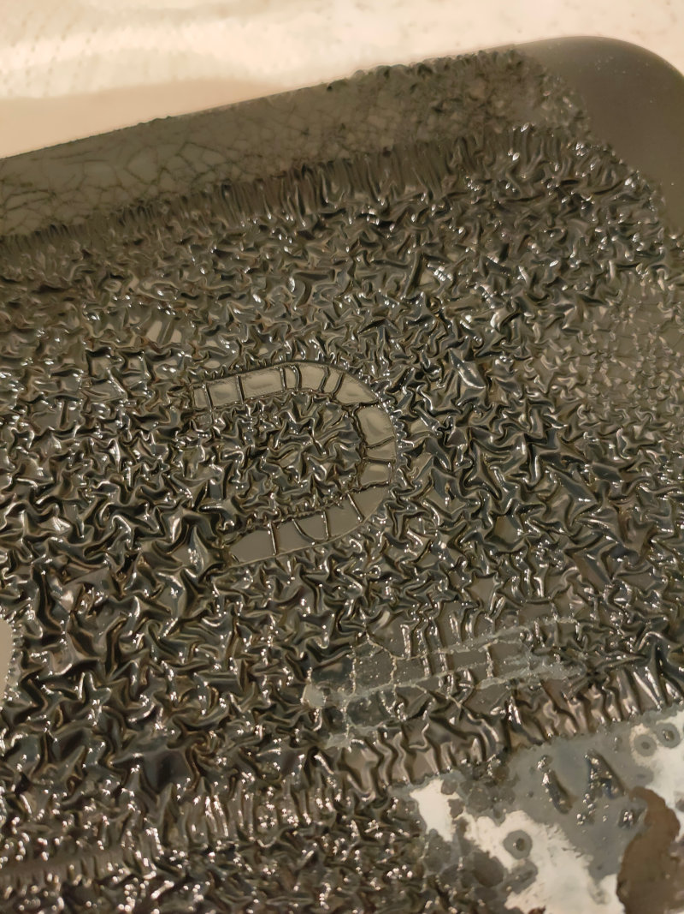
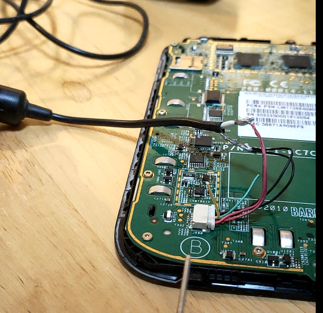
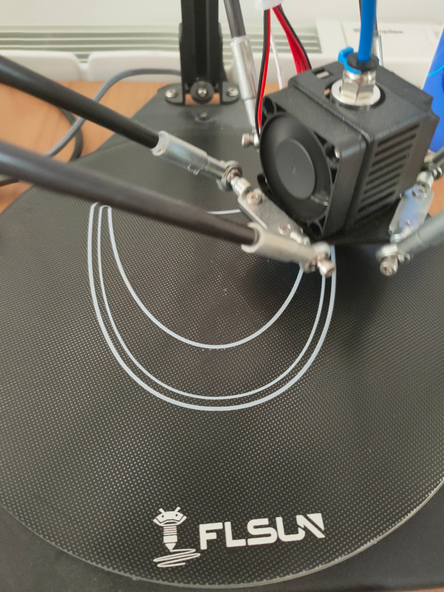
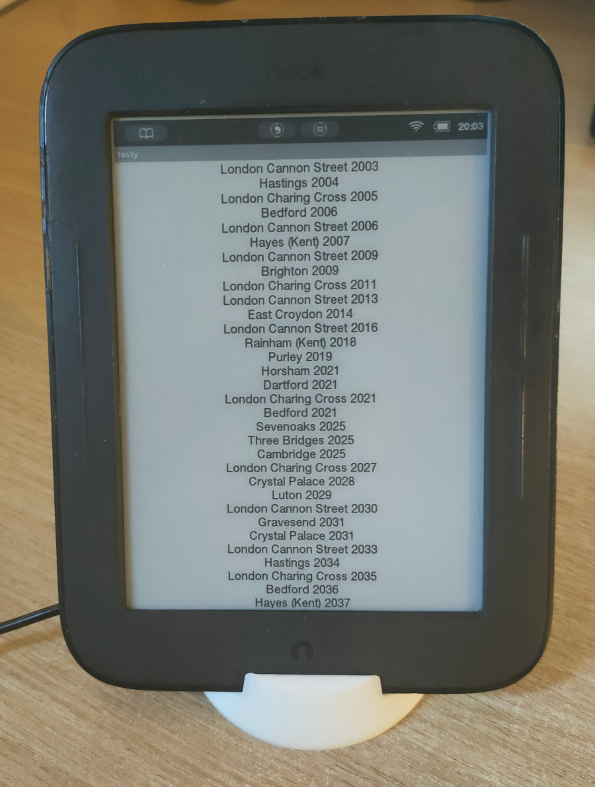

# Quick Hack: Reviving a 2013 Nook Simple Touch

Apart from a sticky back cover, and a dead battery, my Nook Simple Touch bought in 2013 for £29 works just fine.

First I tried alcohol to try to make the back cover less sticky. It didn't do anything. I tried acetone,
because I had a bottle next to the alcohol, which went well.

So now that I don't have a back cover, it's definitely going to be static, no point ordering a new battery.
It could be a train departure board, or a weather display.

Unfortunately, the micro-USB connector charges the battery, it doesn't power the device.
This can be fixed by connecting a random 5V power supply to the battery connector instead.

A stand from https://www.thingiverse.com/thing:1902158 can easily be printed.

Opera mini doesn't support either javascript or meta-refresh, so I had to make an app, rather than just use a web page.

Rooting using NookManager from forum.xda-developers.com is simple enough.

The oldest Android Studio available isn't old enough, so you need an ADT bundle of eclipse + Android SDK. https://stackoverflow.com/a/27682695

Using with sdkman to use an old JDK, 8.0.302-open, because openjdk 11 is too new.

    linux 64 bit: http://dl.google.com/android/adt/adt-bundle-linux-x86_64-20140702.zip
    linux 32 bit: http://dl.google.com/android/adt/adt-bundle-linux-x86-20140702.zip
    MacOS X: http://dl.google.com/android/adt/adt-bundle-mac-x86_64-20140702.zip
    Win32: http://dl.google.com/android/adt/adt-bundle-windows-x86-20140702.zip
    Win64: http://dl.google.com/android/adt/adt-bundle-windows-x86_64-20140702.zip

The android app code is mostly in this repo, as is the train.py script to proxy / parse the train departures, which is running on a raspberry pi.

